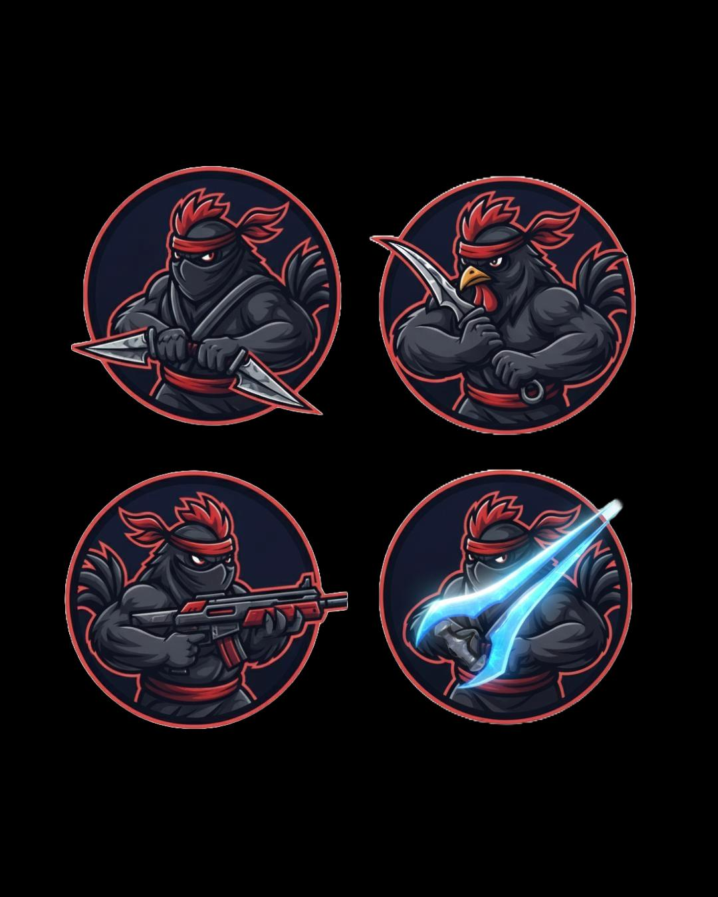
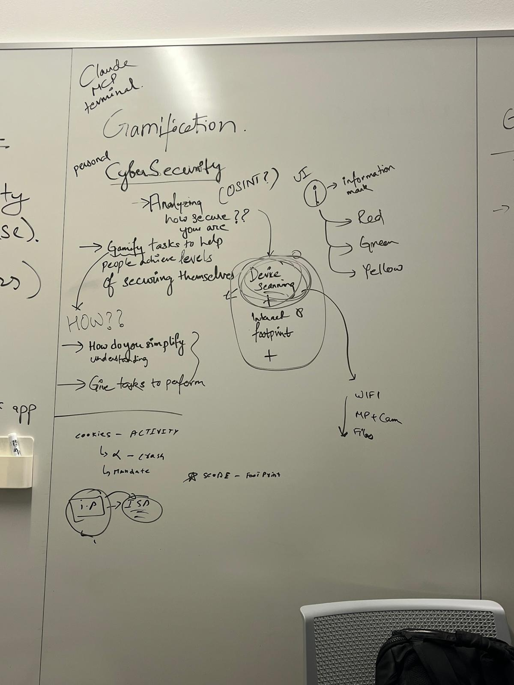
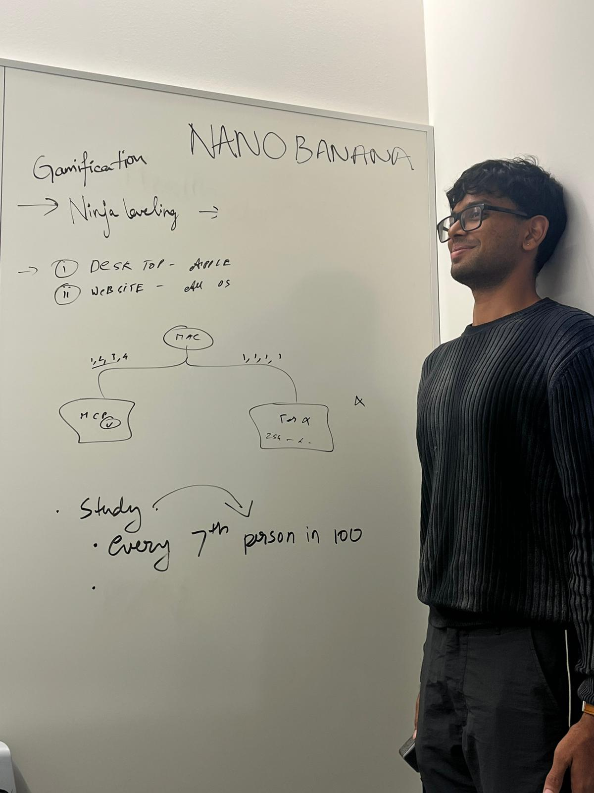
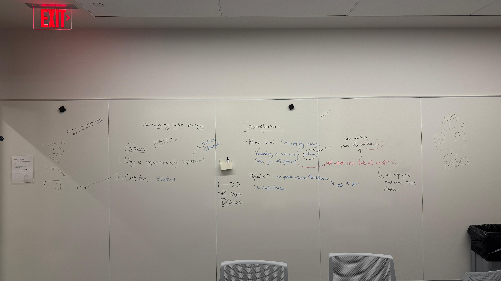

# SimplySecure - macOS Security Scanner
### - By Shadow Chickens!

A ninja-themed macOS desktop application that performs security scans and gamifies the process of securing your MacBook.

## Features

- **Security Scanning**: Checks OS updates, FileVault encryption, and Safari security settings
- **Gamification**: Earn XP and level up as a ninja while fixing security issues
- **AI Assistant**: Google Gemini integration for AI-powered security insights
- **Phishing Simulation**: Retell AI integration for phishing call awareness training
- **Ninja Theme**: Dark/light mode support with ninja-themed UI
- **Real-time Results**: Instant feedback on security status with actionable fixes

## Key Technologies

- **Quiz built using Swift agents**: AI-powered dynamic quiz generation with SwiftAIAgents + Gemini
- **SwiftUI**: Modern declarative UI framework with animations and haptic feedback
- **Privacy policy analysis using Perplexity deep research**: Advanced app privacy analysis and policy research

## Requirements

- macOS Ventura (13.0) or later
- Xcode 14.0 or later
- Admin privileges for some security checks
- Google Gemini API key (optional, for AI features)
- Retell AI API key (optional, for phishing simulation)

## Setup Instructions

1. **Open in Xcode**:
   ```bash
   open SimplySecure.xcodeproj
   ```

2. **Configure Project**:
   - Set deployment target to macOS 13.0+
   - Ensure "Hardened Runtime" is enabled in Build Settings
   - Add "Allow Execution of JIT-compiled Code" entitlement if needed

3. **Configure APIs (Optional)**:
   ```bash
   # Gemini AI for AI Assistant
   ./setup_gemini.sh
   export GEMINI_API_KEY='your_api_key_here'
   
   # Retell AI for Phishing Simulation
   ./setup_retell.sh
   export RETELL_API_KEY='your_api_key_here'
   ```

4. **Build and Run**:
   - Press `Cmd + R` to build and run
   - The app will appear in a single window

## Security Checks

### OS Updates (40 points)
- Uses `softwareupdate --list` to check for pending updates
- Provides option to run `softwareupdate -i -a` for updates

### FileVault Encryption (30 points)
- Uses `fdesetup status` to verify encryption is enabled
- Guides users to System Settings for manual configuration

### Safari Security (20 points)
- Checks Safari's privacy settings and update status
- Provides instructions for enabling tracking protection

## AI Assistant (Gemini Integration)

The app includes a Google Gemini-powered AI assistant that can:
- Explain cybersecurity concepts in simple terms
- Provide personalized security recommendations
- Answer questions about macOS security features
- Generate security awareness content

### Getting Started with AI Features
1. Get a free API key from [Google AI Studio](https://makersuite.google.com/app/apikey)
2. Set your API key: `export GEMINI_API_KEY='your_key_here'`
3. Navigate to the "AI Assistant" tab in the app
4. Start asking security-related questions!

## Phishing Call Simulation (Retell AI Integration)

The app includes a phishing call simulation feature powered by Retell AI that can:
- Create realistic outbound calls for security awareness training
- Generate full call transcriptions with detailed analysis
- Log all call data using NSLog for security analysis
- Provide insights into call sentiment, topics, and key points

### Getting Started with Phishing Simulation
1. Get an API key from [Retell AI](https://retellai.com)
2. Run the setup script: `./setup_retell.sh`
3. Navigate to the "Phishing Sim" tab in the app
4. Enter phone numbers in E.164 format (e.g., +1234567890)
5. Click "Start Phishing Call Simulation" to begin

### How It Works
1. **Create Call**: Initiates an outbound call using Retell AI API
2. **Wait for Completion**: Polls the API every 5 seconds for call completion
3. **Fetch Transcription**: Retrieves the full call transcript when available
4. **Log Results**: All transcription data is logged using NSLog for analysis

The simulation provides comprehensive logging including:
- Call ID and status
- Full conversation transcript
- Call summary and analysis
- Sentiment analysis
- Key topics and points discussed

## Gamification System

### Ninja Levels
- **Novice Ninja** (Level 1): 0-199 XP
- **Apprentice Ninja** (Level 2): 200-399 XP  
- **Master Ninja** (Level 3): 400+ XP

### XP Rewards
- Complete each security check: Earn full points
- Fix failed checks: Earn XP and level up
- Progress tracking with visual progress bars

## Project Structure

```
SimplySecure/
├── SimplySecure/
│   ├── SimplySecureApp.swift      # Main app entry point
│   ├── ContentView.swift          # Main UI with dashboard
│   ├── SecurityScanner.swift      # Security scan logic
│   ├── NinjaGameModel.swift       # Gamification system
│   ├── GeminiAPIService.swift     # Google Gemini API integration
│   ├── RetellAIService.swift      # Retell AI API integration
│   ├── Assets.xcassets           # App icons and assets
│   ├── Info.plist                # App configuration
│   └── SimplySecure.entitlements  # App permissions
├── SimplySecure.xcodeproj        # Xcode project file
├── setup_gemini.sh              # Gemini API setup script
├── setup_retell.sh              # Retell AI API setup script
└── README.md                     # This file
```

## Usage

1. **Launch the app** - Dashboard shows current ninja level and XP
2. **Run Security Scan** - Click the red "Run Security Scan" button
3. **Review Results** - See your security score and mission list
4. **Fix Issues** - Click "Fix" on failed missions for instructions
5. **Earn XP** - Complete fixes to level up your ninja status
6. **Ask AI Assistant** - Use the Gemini-powered AI for security insights
7. **Simulate Phishing** - Test security awareness with realistic call simulations

## Technical Details

- **SwiftUI**: Modern declarative UI framework
- **Process**: Native macOS shell command execution
- **UserDefaults**: Persistent game data storage
- **Async/Await**: Non-blocking security scans
- **URLSession**: HTTP networking for Gemini API calls
- **Combine**: Reactive programming for API responses

## Permissions

The app may request admin privileges for:
- Running `softwareupdate` commands
- Checking FileVault status with `fdesetup`
- Accessing Safari preferences

## Troubleshooting

### Scan Failures
- Ensure you have admin privileges
- Check that Terminal commands work manually
- Some checks may fail in sandboxed environments

### Build Issues
- Verify macOS deployment target is 13.0+
- Check that all Swift files are included in target
- Ensure proper code signing if distributing

## Demo Mode

For hackathon demos:
1. Show the initial scan results
2. Demonstrate fixing a security issue
3. Show XP gain and level progression
4. Highlight the ninja-themed UI

## Future Enhancements

- Network security scans
- Additional browser support
- Leaderboards and achievements
- Custom ninja avatars
- Automated fix execution

---

## Screenshots







**Built by Shadow Chickens** 🥷🐔
